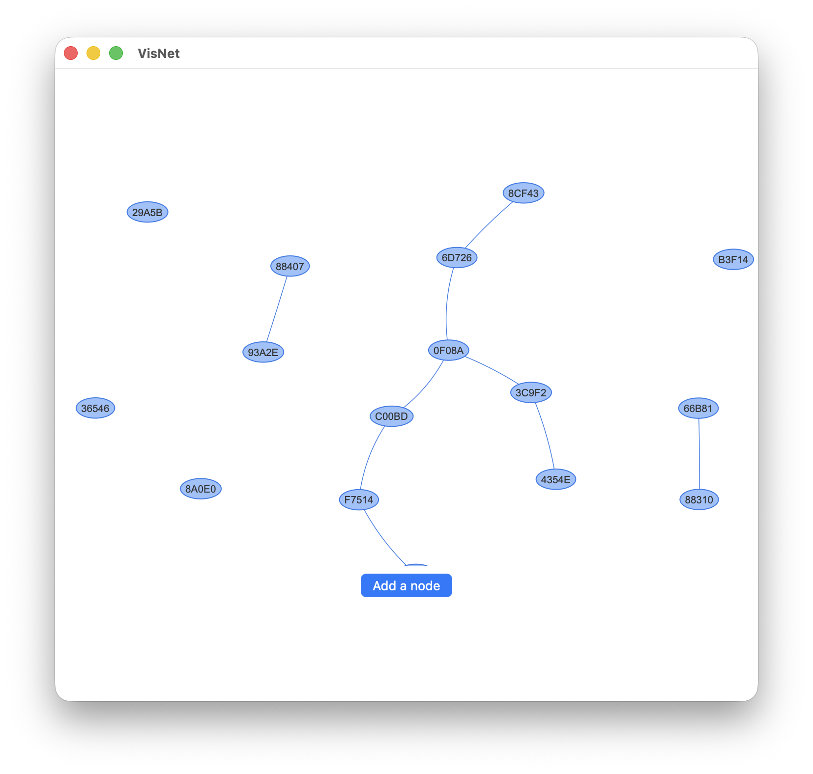

# SwiftUI Network visualization

Some basic code using the [SwiftVisNetwork](https://github.com/workingDog/SwiftVisNetwork)
 a Swift library that interfaces to the javascript visualization library [vis.js community edition](https://visjs.org/) in a SwiftUI app using a WKWebView.

See 

[vis.js community edition](https://visjs.org/), "A dynamic, browser based visualization library.
The library is designed to be easy to use, to handle large amounts of dynamic data, and to enable manipulation of and interaction with the data.
The library consists of the components DataSet, Timeline, Network, Graph2d and Graph3d."

On github, [vis.js](https://github.com/visjs) "Dynamic, browser based visualization libraries".

Specifically [vis-network](https://github.com/visjs/vis-network) a basic network example.

  

